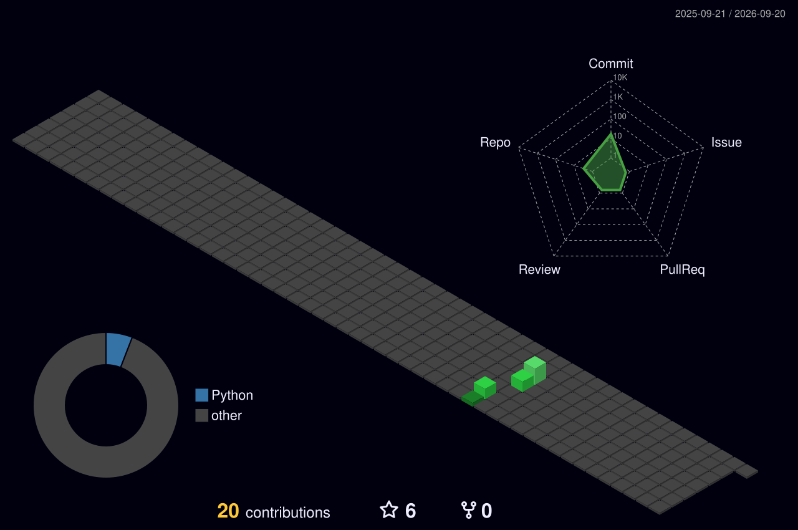

<!-- ═══════════════════════════════════════════════════════════════════════════════════ -->
<!-- ██████╗██╗   ██╗██████╗ ███████╗██████╗ ██╗  ██╗ █████╗ ██╗     ██╗      █████╗ ███╗   ██╗ -->
<!-- ╚══════╝╚═╝   ╚═╝╚═════╝ ╚══════╝╚═╝  ╚═╝╚═╝  ╚═╝╚═╝  ╚═╝╚══════╝╚══════╝╚═╝  ╚═╝╚═╝ ╚═══╝ -->
<!-- ═══════════════════════════════════════════════════════════════════════════════════ -->

<!-- ANIMATED TYPING HEADER -->
<p align="center">
  <a href="https://github.com/shervin-jaison7">
    
    </a>
</p>

<!-- 🎬 PROFILE GIF 🎬 -->
<p align="center">
  
</p>

<!-- PROFILE BADGES -->
<p align="center">
  
  &nbsp;&nbsp;
  
  &nbsp;&nbsp;
  
</p>

<!-- PREMIUM DIVIDER -->


<!-- ╔══════════════════════════════════════════════════════════════╗ -->
<!-- ║                          💀 PROFILE 💀                      ║ -->
<!-- ╚══════════════════════════════════════════════════════════════╝ -->

<h2 align="center">
  
  <samp>&nbsp;HACKER PROFILE&nbsp;</samp>
  
</h2>

<div align="center">

```
╔════════════════════════════════════════════════════════════════════════════════╗
║                                                                                ║
║   ██████╗███╗   ███╗    SHERVIN M JAISON                                       ║
║  ██╔════╝████╗ ████║    ═══════════════════════════════                        ║
║  ██║     ██╔████╔██║    Role    : Cybersecurity Consultant                     ║
║  ██║     ██║╚██╔╝██║    Web Security • Mobile Security • API Security          ║
║  ╚██████╗██║ ╚═╝ ██║    Secure Code Review • Offensive Security                ║
║   ╚═════╝╚═╝     ╚═╝    OWASP Top 10 • Vulnerability Assessment                ║
║                         Penetration Testing                                    ║
║                         Status  : Hunting vulnerabilities before attackers do  ║
║                                                                                ║
║                    "Breaking Security to Build Trust"                          ║
╚════════════════════════════════════════════════════════════════════════════════╝
```

</div>

<br/>


<!-- ╔══════════════════════════════════════════════════════════════╗ -->
<!-- ║                    🛡️ TECH ARSENAL 🛡️                       ║ -->
<!-- ╚══════════════════════════════════════════════════════════════╝ -->

<h2 align="center">
  
  <samp>&nbsp;TECH ARSENAL&nbsp;</samp>
  
</h2>

<h3 align="center">🛡️ Technical Skills in Offensive Security & Pentesting</h3>
<p align="center">
  
  
  
  
  
  
  
  
  
  
</p>

<h3 align="center">📚 Security Methodologies & Standards</h3>
<p align="center">
  
  
  
  
  
  
  
  
  
  
  
</p>

<h3 align="center">💻 Languages & Automation</h3>
<p align="center">
  
  
  
  
  
</p>

<h3 align="center">🛠️ Security Tools & Platforms</h3>
<p align="center">
  
  
  
  
  
  
  
  
  
  
  
  
  
  
  
  
</p>

<br/>

<p align="center">
  
</p>

<br/>


<!-- ╔══════════════════════════════════════════════════════════════╗ -->
<!-- ║              📊 GITHUB STATS DASHBOARD 📊                   ║ -->
<!-- ╚══════════════════════════════════════════════════════════════╝ -->

<h2 align="center">
  
  <samp>&nbsp;GITHUB STATS DASHBOARD&nbsp;</samp>
  
</h2>

<!-- Streak Stats (reliable - no proxy issue) -->
<p align="center">
  <a href="https://github.com/shervin-jaison7">
    
  </a>
</p>

<!-- GitHub Stats & Top Languages — direct API (renders on-the-fly via fast instance) -->
<p align="center">
  <a href="https://github.com/shervin-jaison7">
    
  </a>
  <a href="https://github.com/shervin-jaison7">
    
  </a>
</p>

<br/>


<!-- ╔══════════════════════════════════════════════════════════════╗ -->
<!-- ║              🐍 CONTRIBUTION SNAKE 🐍                       ║ -->
<!-- ╚══════════════════════════════════════════════════════════════╝ -->

<h2 align="center">
  <samp>&nbsp;🐍 CONTRIBUTION SNAKE 🐍&nbsp;</samp>
</h2>

<p align="center">
  <picture>
    <source media="(prefers-color-scheme: dark)" srcset="https://raw.githubusercontent.com/shervin-jaison7/shervin-jaison7/output/github-snake-dark.svg" />
    <source media="(prefers-color-scheme: light)" srcset="https://raw.githubusercontent.com/shervin-jaison7/shervin-jaison7/output/github-snake.svg" />
    
  </picture>
</p>

<br/>


<!-- ╔══════════════════════════════════════════════════════════════╗ -->
<!-- ║                📈  CONTRIBUTION CALENDAR 📈                 ║ -->
<!-- ╚══════════════════════════════════════════════════════════════╝ -->

<h2 align="center">
  <samp>&nbsp;📈 CONTRIBUTION CALENDAR 📈&nbsp;</samp>
</h2>

<p align="center">
  
</p>

<!-- NOTE: This requires the 3D Contribution Graph workflow to have run at least once -->

<br/>


<!-- ╔══════════════════════════════════════════════════════════════╗ -->
<!-- ║                🔥 FEATURED PROJECTS 🔥                      ║ -->
<!-- ╚══════════════════════════════════════════════════════════════╝ -->

<h2 align="center">
  
  <samp>&nbsp;FEATURED PROJECTS&nbsp;</samp>
  
</h2>

<!-- Pin cards — direct API (renders on-the-fly via fast instance) -->
<p align="center">
  <a href="https://github.com/shervin-jaison7/CyberScan_Pro">
    
  </a>
  <a href="https://github.com/shervin-jaison7/Predico">
    
  </a>
</p>

<p align="center">
  <a href="https://github.com/shervin-jaison7/hexmind">
    
  </a>
  <a href="https://github.com/shervin-jaison7/Secure-Code-Review-Checklist">
    
  </a>
</p>

<br/>


<!-- ╔══════════════════════════════════════════════════════════════╗ -->
<!-- ║              📉 ACTIVITY GRAPH 📉                           ║ -->
<!-- ╚══════════════════════════════════════════════════════════════╝ -->

<h2 align="center">
  <samp>&nbsp;📉 ACTIVITY GRAPH 📉&nbsp;</samp>
</h2>

<p align="center">
  
</p>

<br/>


<!-- ╔══════════════════════════════════════════════════════════════╗ -->
<!-- ║              🌐 CONNECT WITH ME 🌐                          ║ -->
<!-- ╚══════════════════════════════════════════════════════════════╝ -->

<h2 align="center">
  
  <samp>&nbsp;CONNECT WITH ME&nbsp;</samp>
  
</h2>

<p align="center">
  <a href="https://github.com/shervin-jaison7">
    
  </a>
  <a href="https://linkedin.com/in/shervin_jaison7">
    
  </a>
  <a href="https://instagram.com/shervin_jaison7">
    
  </a>
  <a href="https://tryhackme.com/p/shervinjaison7">
    
  </a>
  <a href="https://app.hackthebox.com/profile/shervinjaison7">
    
  </a>
</p>

<br/>


<!-- ╔══════════════════════════════════════════════════════════════╗ -->
<!-- ║                    🔥 SHERVIN M JAISON 🔥                   ║ -->
<!-- ╚══════════════════════════════════════════════════════════════╝ -->

<p align="center">
  
</p>

<p align="center">
  
</p>

<!-- ═══════════════════════════════════════════════════════════════════════════════════ -->
<!-- ⚡ POWERED BY: GitHub Actions | capsule-render | streak-stats | skillicons ⚡ -->
<!-- ═══════════════════════════════════════════════════════════════════════════════════ -->


